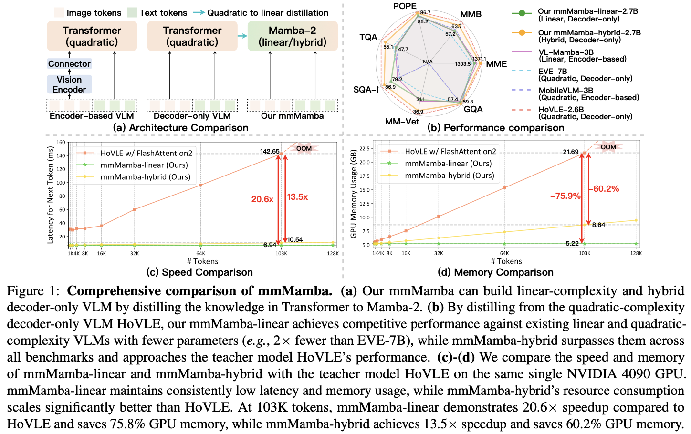

<div align="center">
<h1>mmMamba</h1>
<h3>Decoder-only Multimodal State Space Model via Quadratic to Linear Distillation</h3>

[Bencheng Liao](https://github.com/LegendBC)<sup>1,2,\*</sup>, [Hongyuan Tao](https://github.com/Hongyuan-Tao)<sup>2,\*</sup>, [Qian Zhang](https://scholar.google.com/citations?user=pCY-bikAAAAJ&hl=zh-CN)<sup>3</sup>, [Tianheng Cheng](https://scholar.google.com/citations?user=PH8rJHYAAAAJ&hl=en)<sup>2</sup>,  [Yingyue Li](https://github.com/Yingyue-L)<sup>2</sup>,  Haoran Yin<sup>3</sup>, [Wenyu Liu](https://scholar.google.com/citations?user=D7jDk7gAAAAJ&hl=en)<sup>2</sup>, [Xinggang Wang](https://xwcv.github.io)<sup>2 :email:</sup>
 
<sup>1</sup> Institute of Artificial Intelligence, HUST, <sup>2</sup> School of EIC, HUST, <sup>3</sup> Horizon Robotics

<sup>*</sup> equal contribution, <sup>:email:</sup> corresponding author, xgwang@hust.edu.cn


[](https://arxiv.org/abs/2502.13145)&nbsp;
[](https://huggingface.co/hustvl/mmMamba-linear)&nbsp;
[](https://huggingface.co/hustvl/mmMamba_hybrid)&nbsp;


</div>

## News
* **` Feb. 19th, 2025`:** We released our paper on [Arxiv](https://arxiv.org/abs/2502.13145). We release the initial version of code and weights.


## Table of Contents
- [Introduction](#introduction)
- [Getting Started](#getting-started)
- [Acknowledgement](#acknowledgement)
- [Citation](#citation)

## Introduction
We propose mmMamba, the first decoder-only multimodal state space model achieved through quadratic to linear distillation using moderate academic computing resources. Unlike existing linear-complexity encoder-based multimodal large language models (MLLMs), mmMamba eliminates the need for separate vision encoders and underperforming pre-trained RNN-based LLMs. Through our seeding strategy and three-stage progressive distillation recipe, mmMamba effectively transfers knowledge from quadratic-complexity decoder-only pre-trained MLLMs while preserving multimodal capabilities. Additionally, mmMamba introduces flexible hybrid architectures that strategically combine Transformer and Mamba layers, enabling customizable trade-offs between computational efficiency and model performance.

Distilled from the decoder-only HoVLE-2.6B, our pure Mamba-2-based mmMamba-linear achieves performance competitive with existing linear and quadratic-complexity VLMs, including those with 2x larger parameter size like EVE-7B. The hybrid variant, mmMamba-hybrid, further enhances performance across all benchmarks, approaching the capabilities of the teacher model HoVLE. In long-context scenarios with 103K tokens, mmMamba-linear demonstrates remarkable efficiency gains with a 20.6× speedup and 75.8% GPU memory reduction compared to HoVLE, while mmMamba-hybrid achieves a 13.5× speedup and 60.2% memory savings.

<div align="center">



<b>Seeding strategy and three-stage distillation pipeline of mmMamba.</b>

</div>


## Getting Started

- [Getting started](docs/getting_started.md)
- [Preparation of mmMamba environment](docs/install.md)
- [Training and Evaluation](docs/train_eval.md)
- [Usage](docs/usage.md)

## Acknowledgement
mmMamba is greatly inspired by the following outstanding contributions to the open-source community: [mamba](https://github.com/state-spaces/mamba), [LolCATs](https://github.com/HazyResearch/lolcats), [phi-mamba](https://github.com/goombalab/phi-mamba), [MambaInLlama](https://github.com/jxiw/MambaInLlama), [HoVLE](https://huggingface.co/OpenGVLab/HoVLE), [SOLO](https://github.com/Yangyi-Chen/SOLO), [flash-linear-attention](https://github.com/fla-org/flash-linear-attention).

## Citation
If you find mmMamba is useful in your research or applications, please consider giving us a star 🌟 and citing it by the following BibTeX entry.

```bibtex
@article{liao2025multimodal,
  title={Multimodal Mamba: Decoder-only Multimodal State Space Model via Quadratic to Linear Distillation},
  author={Liao, Bencheng and Tao, Hongyuan and Zhang, Qian and Cheng, Tianheng and Li, Yingyue and Yin, Haoran and Liu, Wenyu and Wang, Xinggang},
  journal={arXiv preprint arXiv:2502.13145},
  year={2025}
}
```
